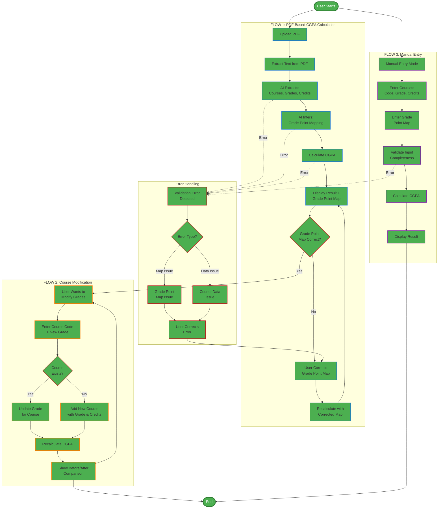
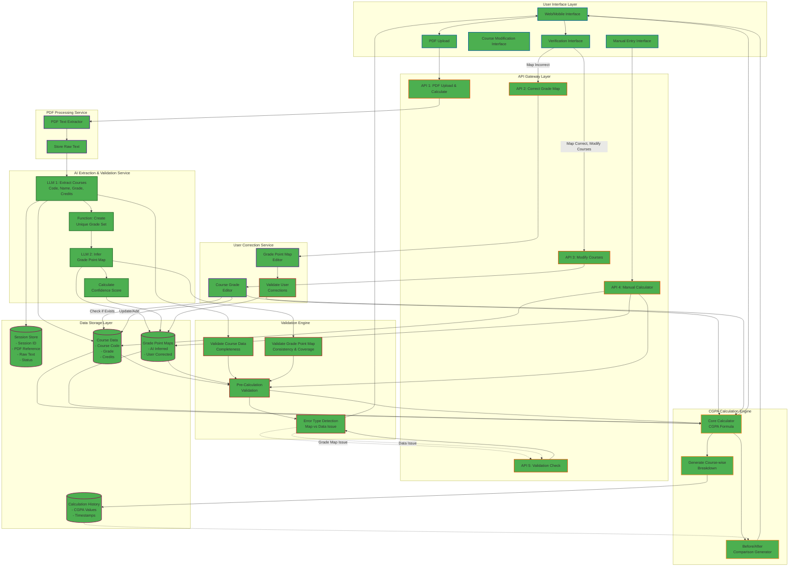
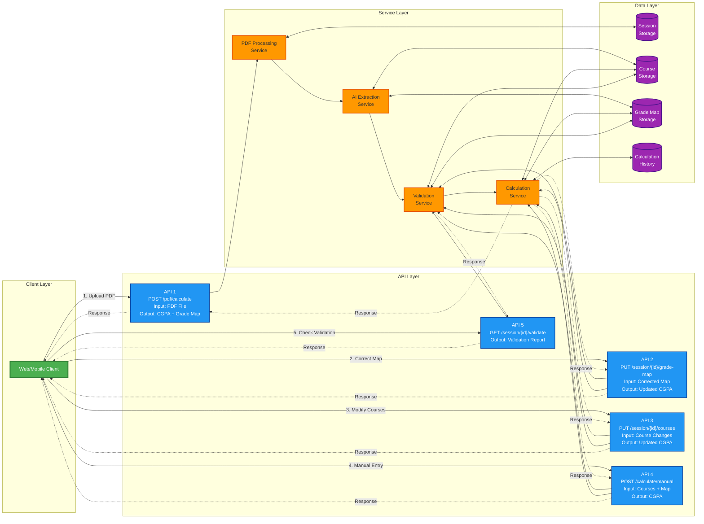

# GPA Horizon

An intelligent assistant for parsing grade transcripts, validating CGPA, and conducting what‑if analyses. It is especially useful for CGPA forecasting, evaluating grade‑improvement exam options, and informing broader academic decisions. Institution‑agnostic by design, it works with any university via a customizable grade‑to‑point map.

## Major features

1) Upload a grade transcript PDF and calculate CGPA automatically
- Frontend lets you upload a PDF transcript.
- Backend extracts courses, credits, and grades and computes CGPA.

2) Custom grade-to-point map (works with any college scheme)
- Edit the grade-to-point mapping (e.g., A+=10, A=9, …) to match your institution.
- Validate the extracted CGPA against your custom map.

3) Add, try, and change course grades to recalculate CGPA
- Add new courses one at a time (code, credits, grade).
- Edit visible course rows and instantly recalculate CGPA.
- Search and paginate through extracted courses.

## How it works

- Streamlit frontend uploads the PDF and calls FastAPI endpoints.
- The backend uses a LangChain pipeline (Google Gemini via langchain-google-genai) to extract structured data from the PDF, or
- A validation utility computes weighted CGPA from courses and the current grade map and compares it to the extracted CGPA.


## Tech stack and tools

- Frontend: Streamlit (Python), requests, session state, pagination UI.
- Backend: FastAPI, Uvicorn, Pydantic v2 models, CORS.
- PDF handling: PyMuPDF (fitz) when using the LLM extraction.
- LLM pipeline: LangChain + Google Gemini (gemini-2.5-flash) with structured output parsing.

## Diagrams
workflow

Architecture-

dataflow -


### LangChain focus

The pipeline (create_full_chain) prompts Gemini to:
- Read the transcript text
- Extract a list of courses (course_code, grade, credits)
- Propose/normalize a grade-to-point map
- Provide an extracted CGPA

The app then:
- Computes CGPA from the extracted courses and map
- Validates against the extracted CGPA
- Surfaces any mismatch and lets you correct the map or course data


## Quick start

Prereqs: Python 3.13

Backend (PowerShell)
```
cd backend
python -m venv venv
./venv/Scripts/Activate.ps1
pip install -r requirements.txt
$env:GOOGLE_GEMINI_API = "your-api-key"
uvicorn main:app --reload
```

Frontend (PowerShell)
```
cd frontend
python -m venv venv
./venv/Scripts/Activate.ps1
pip install -r requirements.txt

# Configure Streamlit secret for backend base URL
# .streamlit/secrets.toml
# [api]
# backend_url = "you url"

streamlit run main.py
```


## CGPA calculation

- Weighted average of grade points by credits
- Result rounded to 2 decimals
